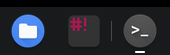
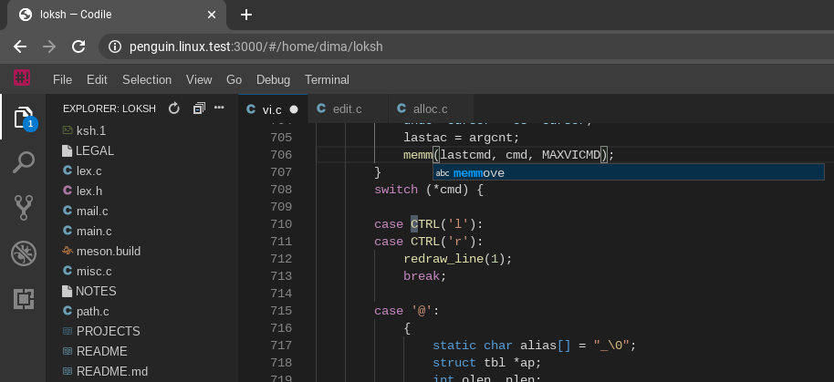

## Background

The immense popularity of [Visual Studio Code](https://code.visualstudio.com/) and its ubiquitous presence in programming courses and education make the access to its vast extensions ecosystem a matter of social justice.

## Overview

Codile (pronounced *coh-dee-leh*) is a distribution of the [Theia](https://theia-ide.org/) IDE, with a relatively small selection of built-in features and complementary support for extensions from the [Open VSX](https://open-vsx.org/) extension registry.

Codile is easy to install and use under [Debian](https://www.debian.org/) and derivatives (including [Crostini](https://chromeos.dev/en/linux)), using [pre-built packages](https://github.com/dimkr/codile/releases).

On [Chrome OS](https://www.google.com/chromebook/chrome-os/), Codile should perform much better than [big-name](https://atom.io/) [extensible](https://code.visualstudio.com/) [IDEs](https://vscodium.com/) that run on [Crostini](https://chromeos.dev/en/linux), because Codile uses the native browser instead of relying on [Electron](https://www.electronjs.org/). The difference is significant on ARM devices, low-end x86 devices and devices where the IDE cannot take advantage of the GPU.

## License

- [Eclipse Public License 2.0](LICENSE)
- [一 (Secondary) GNU General Public License, version 2 with the GNU Classpath Exception](LICENSE)

## Trademarks

"Theia" is a trademark of the [Eclipse Foundation](https://www.eclipse.org/theia).
"Chrome OS" is a trademark of [Google Inc](https://www.google.com/). Use of this trademark is subject to Google Permissions.